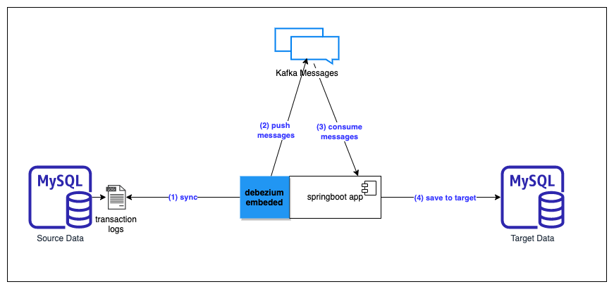

# springboot-debezium CDC

This project show the sample code how to capture data using CDC concept. We applied two libraries which are `debezium` and `kafka`, `debezium-embeded` was used for monitor transaction logs from source-database then push data to `kafka topic` and the data was saved to target-database by consumers.

## Project Diagram



## Prerequisites

- [`Java 11+`](https://www.oracle.com/java/technologies/downloads/#java11)
- [`Docker-Compose`](https://docs.docker.com/compose/install/)
- `Mysql`
- `Kafka`

## Getting Started

- Open a terminal and go to `cdc-debezium` root folder, run the following command
  ```
  docker-compose up -d
  ```

- Wait until all containers UP and running, using this command
  ```
  docker-compose ps
  ```

- Download dependencies and build
  ```
  mvn clean install
  ```

- Create customer table on 2 database (`cdc-source-database`, `cdc-target-database`), using this script
  ```
  initail_table.sql
  ```

- Running springboot
  ```
  mvn spring-boot:run
  ```

## Testing

- Manual insert data to source-database and see the data will be sync to target-database.

  ```
  INSERT INTO customerdb.customer (id, fullname, email) VALUES (1, 'foo', 'bar')
  ```


## References

- https://www.baeldung.com/debezium-intro
- https://debezium.io/
